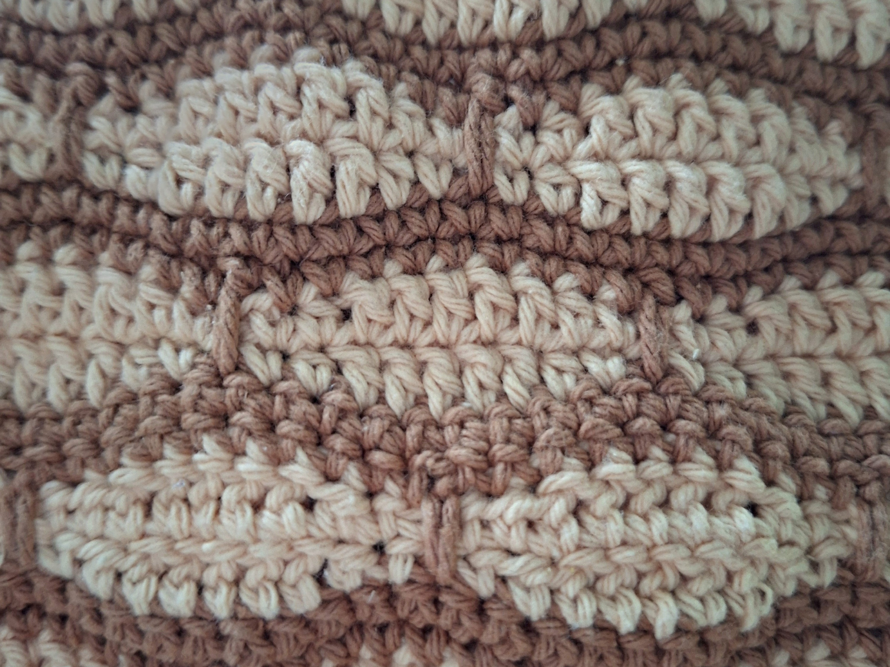

## Honeycomb Crochet Pouch

Nature has a way of creating beautiful patterns, and honeycombs have always been one of my favorites.

When I discovered the Millstone Stitch, its layered texture immediately reminded me of stacked honeycomb cells. Warm shades of cream and caramel completed the look and made this crochet pouch feel cozy and earthy.

This project was one of those relaxing makes where every row looked a little different as the texture developed. Trying new crochet stitches is one of my favorite parts of this hobby, even when I don't know exactly how the finished piece will look.

Made with 100% cotton yarn, this crochet pouch is sturdy enough for everyday use while showing off the beautiful texture of the stitch.

## Details

- 100% cotton yarn
- 3 mm crochet hook
- [Millstone Stitch](https://nordichook.com/the-millstone-stitch/)
- Finished size: approximately 17 × 14 cm

*Inspired by the repeating beauty of honeycombs.*

*Close-up of the millstone stitch and color changes.*