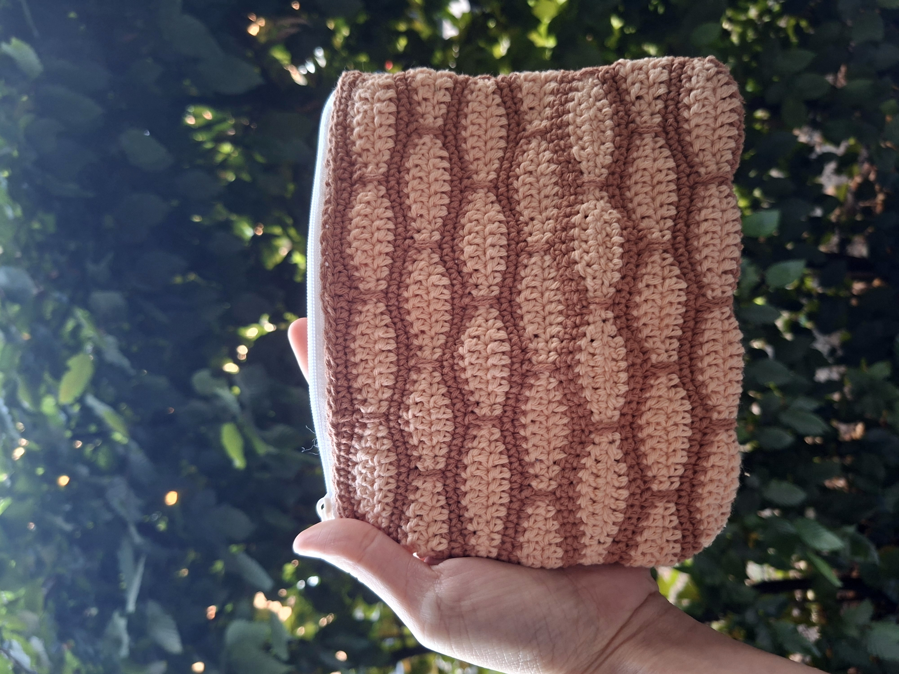

## Honeycomb Pouch

Sometimes inspiration comes from the smallest things.

I've always loved the neat, repeating pattern of honeycombs. There's something satisfying about how every little piece fits together, creating something both simple and beautiful. I wanted to capture that feeling in crochet, so I reached for the [Millstone Stitch](https://nordichook.com/the-millstone-stitch/). The layered texture reminded me of stacked honeycomb cells, especially with these warm caramel and cream colors.

This project came together surprisingly quickly. The stitch has enough texture to keep every row interesting, but it's also relaxing once you get into the rhythm. It's one of those patterns that makes you want to crochet "just one more row."

As usual, I used 100% cotton yarn because I love how well it holds its shape. The finished pouch is just the right size for little everyday essentials, and I think the textured fabric gives it a cozy, handmade feel.

## Details

- 100% cotton yarn
- 3 mm crochet hook
- [Millstone Stitch](https://nordichook.com/the-millstone-stitch/)
- Finished size: approximately 17 × 14 cm

*Warm colors and textured stitches inspired by honeycombs.*

*Close-up of the texture and color changes.*