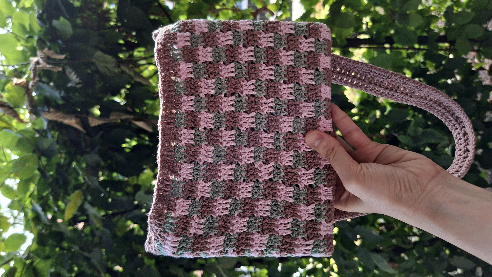
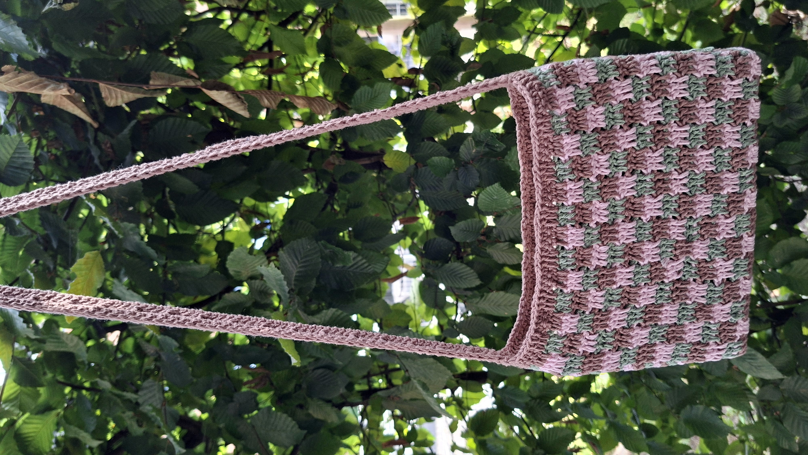
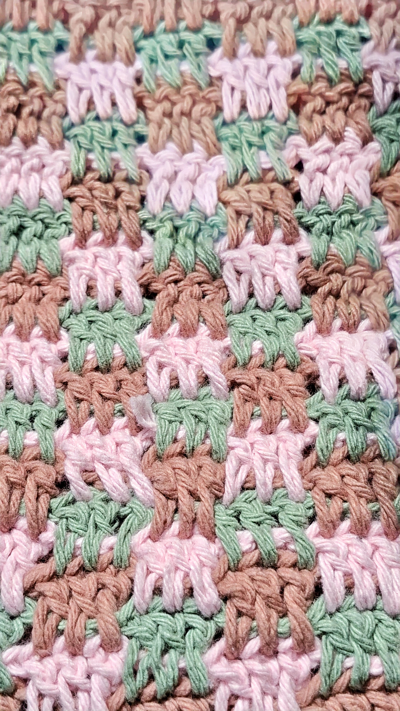

## 2000s-Inspired Checkered Crochet Crossbody Bag

I've seen so many beautiful checkered crochet bags online, and most of them seem to play with two colors. I wanted to see what would happen if I added a third.

That's how this bag started.

I came across the <a href="https://nordichook.com/the-interlocking-block-stitch/" target="_blank" rel="noopener noreferrer">Interlocking Block Stitch</a> and immediately liked how different it was from a regular checkered pattern. Instead of simply working two colors into squares, the stitch creates an interlocking pattern of three blocks.

Then came the colors.

I chose pink, sage green, and brown, and once the bag started taking shape, I couldn't help thinking of the early 2000s. The combination has that slightly nostalgic, playful look that reminds me of the colors and accessories from that time.

So instead of making a regular tote, I decided to turn it into a crossbody bag. The longer strap seemed to fit the slightly retro look much better, and also makes it the kind of bag I'd actually want to carry around.

## Details

- 100% cotton yarn
- <a href="https://nordichook.com/the-interlocking-block-stitch/" target="_blank" rel="noopener noreferrer">Interlocking Block Stitch</a>
- Pink, sage green, and brown
- 3mm hook
- Crossbody style

*Three colors, interlocking squares, and a little bit of 2000s nostalgia.*

*Close-up of the stitch and color changes.*