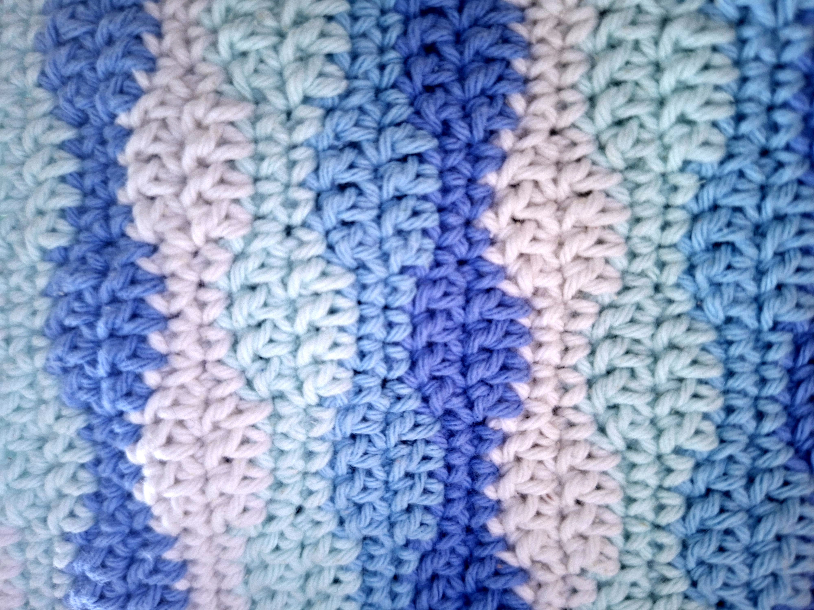

## Ocean Wave Pouch

I think this might be one of my favorite pouches I've made so far.

I wanted to make something that felt calm and a little bit like the ocean — soft colors, gentle waves, and a texture that you can't help but touch. I chose these shades of blue, lavender, and white because they reminded me of quiet mornings near the water, when everything feels a little slower.

The wave stitch was a bit of an experiment. I wasn't sure how the colors would come together at first, but row by row, the little waves started to appear. It was one of those projects where you don't really know the final look until the very last stitch.

Made with 100% cotton yarn, this little pouch is the perfect size for carrying small everyday things. But mostly, I just love how it turned out — a tiny piece of handmade calm.

## Details

- 100% cotton yarn
- 3mm crochet hook
- Wave stitch pattern
- Size: approximately 16 × 12 cm

*The finished pouch, photographed outside on a sunny day.*

*Close-up of the wave texture and color changes.*
