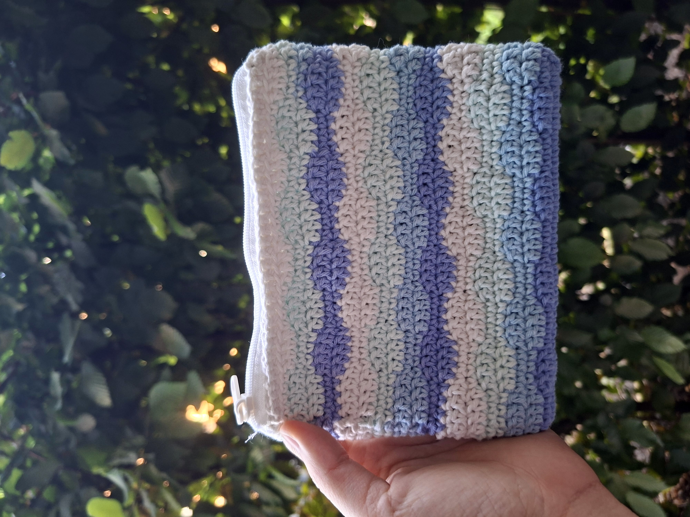

## Ocean Wave Crochet Pouch

If you're looking for crochet pouch ideas inspired by nature, this little project might be one of my favorites.

I wanted to create something that felt calm and peaceful, so I chose soft shades of blue, lavender, and white to remind me of the ocean. As each row came together, the wave stitch slowly revealed itself, making the pouch feel almost like ripples across the water.

The wave stitch was new to me, and I enjoyed watching the texture develop one row at a time. It's always fun trying different stitches because they completely change the personality of a crochet bag or pouch.

Made with 100% cotton yarn, this crochet pouch is the perfect size for everyday essentials. More than anything, it reminds me that sometimes the simplest color combinations create the most satisfying projects.

## Details

- 100% cotton yarn
- 3 mm crochet hook
- Wave Stitch
- Size: approximately 16 × 12 cm

*Inspired by calm seas and soft summer colours.*

*Close-up of the wave texture and color changes.*
